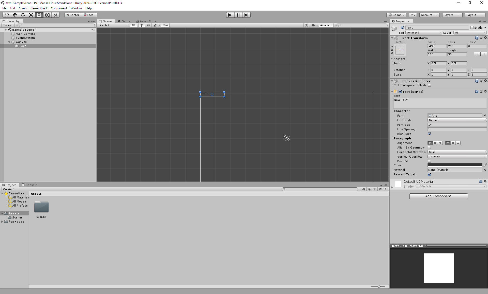

# Rube Goldberg Machine

this section will be explaining how to add text to unity.

### Adding text

Let's add the text. It is under the UI section of game object.

Once you've added the text object, you will see that another object was created, "Canvas". 
When adding text to Unity, you will need it to be within the canvas in the heirarchy. This
will happen when you create your first text object. This will also automatically happen when
you create a text object if you have a canvas already.

Imagine the canvas as a game view for your text object. Instead of placing your text where
you want it within the camera view, you will place it in the canvas. If you place it in the
top left corner of the canvas, when you play your game, it will be in the top left of the game
view. In this example, it is shown in the top corner of the canvas and the top corner of the
game view. 

