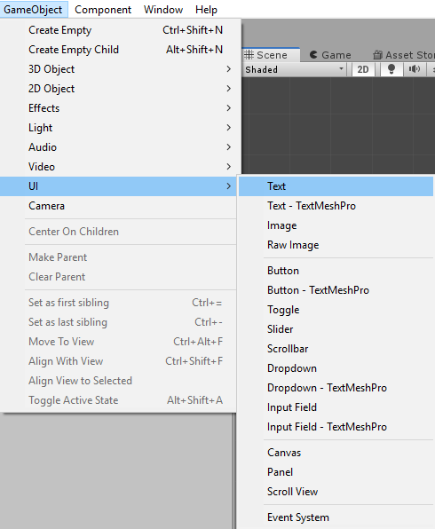

# Rube Goldberg Machine

this section will be explaining how to add text to unity.

### Adding text

Let's add the text. It is under the UI section of game object.

Once you've added the text object, you will see that another object was created, "Canvas". 
When adding text to Unity, you will need it to be within the canvas in the heirarchy. This
will happen when you create your first text object. This will also automatically happen when
you create a text object if you have a canvas already.

